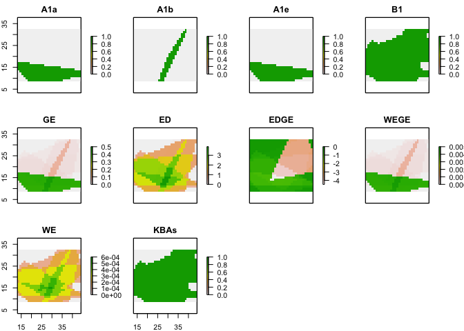

<!-- README.md is generated from README.Rmd. Please edit that file -->
<!-- devtools::rmarkdown::render("README.Rmd") -->
<!-- Rscript -e "library(knitr); knit('README.Rmd')" -->
WEGE index
==========

WEGE is an R package that allows the user to calculate the WEGE index for a particular area. Additionally it also calculates rasters of KBA criteria (A1a, A1b, A1e, and B1) Weighted endemism, the EDGE score, Evolutionary Distinctiveness and Extinction risk.

Install
=======

The package can currently only be installed through GitHub:

``` r
# install.packages("remotes")
remotes::install_github("harithmorgadinho/wege_ind")
```

Usage
=====

A get\_edge example:

``` r
library(WEGE) 
library(sp)
#> Warning: package 'sp' was built under R version 3.5.2
library(sf)
#> Linking to GEOS 3.6.1, GDAL 2.1.3, PROJ 4.9.3

species <- letters[1:26]
range_list <- list()
for (i in seq_along(species)) {
  temp0 <- cbind(runif(3,1,50),runif(3,1,50))
  temp <- Polygon(rbind(temp0,temp0[1,]))
  range_list[[i]] <- Polygons(list(temp), ID = c(species[i]))
}
input <- st_as_sf(SpatialPolygons(range_list))
categories <- c('LC','NT','VU','EN','CR')
input$binomial <- species
input$category <- sample(size = nrow(input),x = categories,replace = TRUE)
input$ED <- runif(nrow(input),1,30)
temp0 <- cbind(runif(3,1,50),runif(3,1,50))
target_area <- Polygon(rbind(temp0,temp0[1,]))
target_area <- Polygons(list(target_area), ID = 'Target area')
target_area <- st_as_sf(SpatialPolygons(list(target_area)))

get_edge(target_area = target_area,input = input,species = 'binomial',category = 'category')
#> [[1]]
#> [1] 23.60822
```

A get\_wege example:

``` r
library(sp)
library(sf)
library(WEGE)

species <- letters[1:26]
range_list <- list()
for (i in seq_along(species)){
  temp  <-  Polygon(cbind(runif(4,1,50),runif(4,1,50)))
  range_list[[i]] <- Polygons(list(temp), ID = c(species[i]))}
input <- st_as_sf(SpatialPolygons(range_list))
categories <- c('LC','NT','VU','EN','CR')
input$binomial <- species
input$category <- sample(size = nrow(input),x = categories,replace = TRUE)

target_area <- Polygon(cbind(runif(4,1,50),runif(4,1,50)))
target_area <- Polygons(list(target_area), ID = 'Target area')
target_area <- st_as_sf(SpatialPolygons(list(target_area)))
get_wege(target_area,input,species = 'binomial',category = 'category')
#> [[1]]
#> [1] 312.7381
```

A get\_kba-criteria example:

``` r
library(WEGE)
library(sp)
library(sf)

species <- letters[1:26]
range_list <- list()
for (i in seq_along(species)){
  temp0 <- cbind(runif(3,1,50),runif(3,1,50))
  temp  <-  Polygon(rbind(temp0,temp0[1,]))
  range_list[[i]] <- Polygons(list(temp), ID = c(species[i]))
}
input <- st_as_sf(SpatialPolygons(range_list))
categories <- c('LC','NT','VU','EN','CR')
input$binomial <- species
input$category <- sample(size = nrow(input),x = categories,replace = TRUE)

temp0 <- cbind(runif(3,1,50),runif(3,1,50))
target_area <- Polygon(rbind(temp0,temp0[1,]))
target_area <- Polygons(list(target_area), ID = 'Target area')
target_area <- st_as_sf(SpatialPolygons(list(target_area)))
get_kba_criteria(target_area,input)
#>    species         area category     area_kba  perc_kba A1a A1b A1e  B1
#> 1        a 2.947391e-05       CR 1.786149e-06  6.060102 yes  no  no  no
#> 2        b 2.768724e-04       EN 7.429253e-05 26.832764 yes  no  no yes
#> 3        e 2.434958e-04       CR 1.244859e-04 51.124459 yes  no  no yes
#> 4        f 3.128119e-04       CR 3.224454e-05 10.307965 yes  no  no yes
#> 5        g 4.479853e-04       NT 1.918042e-04 42.814836  no  no  no yes
#> 6        h 2.102851e-04       NT 1.337322e-04 63.595688  no  no  no yes
#> 7        j 1.013406e-04       EN 3.655669e-05 36.073100 yes  no  no yes
#> 8        k 4.449901e-04       VU 1.025432e-04 23.043938  no yes  no yes
#> 9        m 3.871863e-04       CR 1.013974e-04 26.188272 yes  no  no yes
#> 10       n 4.809546e-04       NT 2.858035e-04 59.424224  no  no  no yes
#> 11       o 9.440874e-05       NT 2.502407e-05 26.506091  no  no  no yes
#> 12       q 5.152714e-04       CR 2.376042e-04 46.112449 yes  no  no yes
#> 13       r 5.082501e-05       EN 3.078056e-05 60.561836 yes  no  no yes
#> 14       s 2.523799e-04       VU 1.587406e-04 62.897513  no yes  no yes
#> 15       t 2.591122e-04       LC 8.592068e-05 33.159645  no  no  no yes
#> 16       u 5.776036e-05       LC 5.589551e-05 96.771400  no  no  no yes
#> 17       v 6.707679e-05       NT 1.720175e-05 25.644862  no  no  no yes
#> 18       w 2.207896e-04       NT 9.193474e-05 41.639073  no  no  no yes
#> 19       x 6.142535e-04       VU 2.235084e-04 36.386998  no yes  no yes
#> 20       y 9.276385e-05       CR 4.771320e-05 51.435119 yes  no  no yes
#> 21       z 3.607598e-04       EN 9.905803e-05 27.458169 yes  no  no yes
```

A raster example example:

``` r
library(WEGE)
library(sp)
library(sf)
library(raster)
#> Warning: package 'raster' was built under R version 3.5.2

 species <- sample(letters, 10)
 range_list <- list()
 for (i in seq_along(species)) {
   temp0 <- cbind(runif(3,1,50),runif(3,1,50))
   temp <- Polygon(rbind(temp0,temp0[1,]))
   range_list[[i]] <- Polygons(list(temp), ID = c(species[i]))
   }
 input <- st_as_sf(SpatialPolygons(range_list))
 categories <- c('LC','NT','VU','EN','CR')
 input$binomial <- species
 input$category <- sample(size = nrow(input),x = categories,replace = TRUE)
 
 input$ed <- runif(runif(10,1,50))
 temp0 <- cbind(runif(3,1,50),runif(3,1,50))
 target_area <- Polygon(rbind(temp0,temp0[1,]))
 target_area <- Polygons(list(target_area), ID = 'Target area')
 target_area <- st_as_sf(SpatialPolygons(list(target_area)))
 spat_ras(target_area,input,species = 'binomial',ed='ed', res = 1)
#> 1 7442 7443 7444 7445 7446 7447 7448 7449 74410 74411 74412 74413 74414 74415 74416 74417 74418 74419 74420 74421 74422 74423 74424 74425 74426 74427 74428 74429 74430 74431 74432 74433 74434 74435 74436 74437 74438 74439 74440 74441 74442 74443 74444 74445 74446 74447 74448 74449 74450 74451 74452 74453 74454 74455 74456 74457 74458 74459 74460 74461 74462 74463 74464 74465 74466 74467 74468 74469 74470 74471 74472 74473 74474 74475 74476 74477 74478 74479 74480 74481 74482 74483 74484 74485 74486 74487 74488 74489 74490 74491 74492 74493 74494 74495 74496 74497 74498 74499 744100 744101 744102 744103 744104 744105 744106 744107 744108 744109 744110 744111 744112 744113 744114 744115 744116 744117 744118 744119 744120 744121 744122 744123 744124 744125 744126 744127 744128 744129 744130 744131 744132 744133 744134 744135 744136 744137 744138 744139 744140 744141 744142 744143 744144 744145 744146 744147 744148 744149 744150 744151 744152 744153 744154 744155 744156 744157 744158 744159 744160 744161 744162 744163 744164 744165 744166 744167 744168 744169 744170 744171 744172 744173 744174 744175 744176 744177 744178 744179 744180 744181 744182 744183 744184 744185 744186 744187 744188 744189 744190 744191 744192 744193 744194 744195 744196 744197 744198 744199 744200 744201 744202 744203 744204 744205 744206 744207 744208 744209 744210 744211 744212 744213 744214 744215 744216 744217 744218 744219 744220 744221 744222 744223 744224 744225 744226 744227 744228 744229 744230 744231 744232 744233 744234 744235 744236 744237 744238 744239 744240 744241 744242 744243 744244 744245 744246 744247 744248 744249 744250 744251 744252 744253 744254 744255 744256 744257 744258 744259 744260 744261 744262 744263 744264 744265 744266 744267 744268 744269 744270 744271 744272 744273 744274 744275 744276 744277 744278 744279 744280 744281 744282 744283 744284 744285 744286 744287 744288 744289 744290 744291 744292 744293 744294 744295 744296 744297 744298 744299 744300 744301 744302 744303 744304 744305 744306 744307 744308 744309 744310 744311 744312 744313 744314 744315 744316 744317 744318 744319 744320 744321 744322 744323 744324 744325 744326 744327 744328 744329 744330 744331 744332 744333 744334 744335 744336 744337 744338 744339 744340 744341 744342 744343 744344 744345 744346 744347 744348 744349 744350 744351 744352 744353 744354 744355 744356 744357 744358 744359 744360 744361 744362 744363 744364 744365 744366 744367 744368 744369 744370 744371 744372 744373 744374 744375 744376 744377 744378 744379 744380 744381 744382 744383 744384 744385 744386 744387 744388 744389 744390 744391 744392 744393 744394 744395 744396 744397 744398 744399 744400 744401 744402 744403 744404 744405 744406 744407 744408 744409 744410 744411 744412 744413 744414 744415 744416 744417 744418 744419 744420 744421 744422 744423 744424 744425 744426 744427 744428 744429 744430 744431 744432 744433 744434 744435 744436 744437 744438 744439 744440 744441 744442 744443 744444 744445 744446 744447 744448 744449 744450 744451 744452 744453 744454 744455 744456 744457 744458 744459 744460 744461 744462 744463 744464 744465 744466 744467 744468 744469 744470 744471 744472 744473 744474 744475 744476 744477 744478 744479 744480 744481 744482 744483 744484 744485 744486 744487 744488 744489 744490 744491 744492 744493 744494 744495 744496 744497 744498 744499 744500 744501 744502 744503 744504 744505 744506 744507 744508 744509 744510 744511 744512 744513 744514 744515 744516 744517 744518 744519 744520 744521 744522 744523 744524 744525 744526 744527 744528 744529 744530 744531 744532 744533 744534 744535 744536 744537 744538 744539 744540 744541 744542 744543 744544 744545 744546 744547 744548 744549 744550 744551 744552 744553 744554 744555 744556 744557 744558 744559 744560 744561 744562 744563 744564 744565 744566 744567 744568 744569 744570 744571 744572 744573 744574 744575 744576 744577 744578 744579 744580 744581 744582 744583 744584 744585 744586 744587 744588 744589 744590 744591 744592 744593 744594 744595 744596 744597 744598 744599 744600 744601 744602 744603 744604 744605 744606 744607 744608 744609 744610 744611 744612 744613 744614 744615 744616 744617 744618 744619 744620 744621 744622 744623 744624 744625 744626 744627 744628 744629 744630 744631 744632 744633 744634 744635 744636 744637 744638 744639 744640 744641 744642 744643 744644 744645 744646 744647 744648 744649 744650 744651 744652 744653 744654 744655 744656 744657 744658 744659 744660 744661 744662 744663 744664 744665 744666 744667 744668 744669 744670 744671 744672 744673 744674 744675 744676 744677 744678 744679 744680 744681 744682 744683 744684 744685 744686 744687 744688 744689 744690 744691 744692 744693 744694 744695 744696 744697 744698 744699 744700 744701 744702 744703 744704 744705 744706 744707 744708 744709 744710 744711 744712 744713 744714 744715 744716 744717 744718 744719 744720 744721 744722 744723 744724 744725 744726 744727 744728 744729 744730 744731 744732 744733 744734 744735 744736 744737 744738 744739 744740 744741 744742 744743 744744 744
```



    #> class      : RasterStack 
    #> dimensions : 24, 31, 744, 10  (nrow, ncol, ncell, nlayers)
    #> resolution : 1, 1  (x, y)
    #> extent     : 13.19312, 44.19312, 8.554813, 32.55481  (xmin, xmax, ymin, ymax)
    #> crs        : NA 
    #> names      :       A1a,       A1b,       A1e,        B1,        GE,        ED,      EDGE,      WEGE,        WE,      KBAs 
    #> min values :  0.000000,  0.000000,  0.000000,  0.000000,  0.000000,  0.000000, -4.475515,  0.000000,  0.000000,  0.000000 
    #> max values :  1.000000,  1.000000,  1.000000,  1.000000,  0.501100,  3.891238,  0.000000,  0.005011,  0.000600,  1.000000

Citation:
=========

Farooq, H., Azevedo, J., Belluardo F., Nanvonamuquitxo, C., Bennett, D., Moat, J., Soares, A., Faurby, S. & Antonelli, A. (2020). Wege: A New Metric for Ranking Locations for Biodiversity Conservation. bioRxiv. <https://doi.org/10.1101/2020.01.17.910299>
